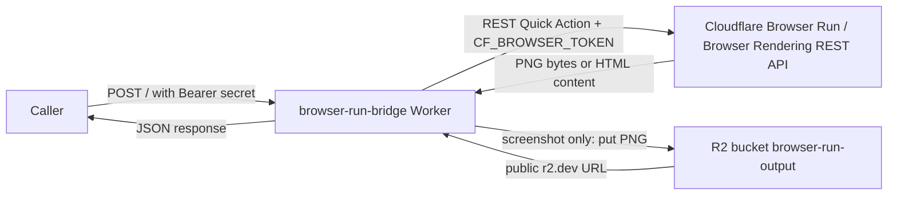

# browser-run-bridge

`browser-run-bridge` is the Das Experten internal Cloudflare Worker that exposes two authenticated browser actions over HTTP: render a page to a screenshot PNG in R2, or render a page and return stripped text.

## At a glance

| Item | Live value |
|---|---|
| Worker name | `browser-run-bridge` |
| Public URL | `https://browser-run-bridge.dasexperten.workers.dev` |
| Cloudflare account ID | `081ddb85cb399ad62a70210328d744fc` |
| R2 bucket | `browser-run-output` |
| R2 public domain | `pub-6cf4bb0064824477882515a6afa6e43f.r2.dev` |
| R2 lifecycle rule | `delete-after-30-days`, enabled, prefix ``, maxAge `2592000` seconds |
| R2 storage class | `Standard` |
| R2 location | `ENAM` |
| Worker compatibility date | `2026-05-01` |
| Live compatibility flags | none returned by the Worker settings API |
| Last deployed timestamp | `2026-05-07T10:37:09.764678Z` |
| Last deployed from | `api` |
| Live script tag | `3e2983c3c3124cab88e5b0b0557c9241` |

Inspection sources used for this document: GitHub `main` source files in `workers/browser-run-bridge/`, Cloudflare Worker and R2 REST metadata, live smoke tests on `2026-05-07`, and Cloudflare public pricing/limits documentation linked in the cost section.

## Architecture diagram



For `extract_text`, the Worker does not write to R2. For `screenshot`, the Worker stores the PNG in R2 and returns a public URL.

## Authentication

Every request to the Worker must use this header:

```http
Authorization: Bearer $BRIDGE_SECRET
```

`BRIDGE_SECRET` is a Worker secret, not a source-controlled value. Do not put the literal secret in this README, code, examples, commits, issue comments, logs, or screenshots. The owner-designated secret inventory is `secrets-and-tokens.md`; that file was not present in the GitHub `main` tree during inspection, so treat it as an internal operator document outside this Worker folder until the repository adds it.

The Worker compares the incoming header exactly to `Bearer ${env.BRIDGE_SECRET}`. Missing header, wrong scheme, extra text, or the wrong token returns:

```json
{"error":"unauthorized"}
```

## Actions reference

### `screenshot`

`screenshot` opens the requested HTTP or HTTPS URL through Cloudflare Browser Run Quick Actions, captures a full-page PNG, writes it to the `OUTPUT` R2 bucket, and returns the public R2 URL plus the stored object key, byte size, and Browser Run milliseconds reported by Cloudflare.

Request schema:

| Field | Type | Required | Default | Range or validation | Meaning |
|---|---:|---:|---:|---|---|
| `action` | string | yes | none | must be `screenshot` | Dispatcher action name. |
| `url` | string | yes | none | must parse as `http:` or `https:` | Page to render. The original requested URL is hashed into the R2 key. |
| `options` | object | no | `{}` | non-object is ignored | Optional rendering controls. |
| `options.viewport` | object | no | `{ "width": 1280, "height": 800 }` | non-object is ignored | Browser viewport. |
| `options.viewport.width` | number-like | no | `1280` | finite, `> 0`, `<= 3840`; otherwise ignored | Width is floored before use. |
| `options.viewport.height` | number-like | no | `800` | finite, `> 0`, `<= 2160`; otherwise ignored | Height is floored before use. |
| `options.wait_ms` | number-like | no | `0` | finite and `> 0`, capped at `10000`; otherwise `0` | Passed to Browser Run as `waitForTimeout`. |

Success response schema:

| Field | Type | Meaning |
|---|---:|---|
| `ok` | boolean | Always `true` on success. |
| `action` | string | Always `screenshot`. |
| `url` | string | Public R2 URL for the PNG. |
| `key` | string | R2 object key under `screenshot/YYYY-MM-DD/`. |
| `size_bytes` | number | PNG byte length stored in R2. |
| `browser_ms_used` | number | Browser Run milliseconds from `X-Browser-Ms-Used`, or elapsed Worker time if the header is absent. |

Live example command:

```bash
curl -sS -X POST "https://browser-run-bridge.dasexperten.workers.dev/" \
  -H "Authorization: Bearer $BRIDGE_SECRET" \
  -H "Content-Type: application/json" \
  --data-binary '{"action":"screenshot","url":"https://example.com"}'
```

Live captured response from `2026-05-07` after one 429 retry:

```json
{"ok":true,"action":"screenshot","url":"https://pub-6cf4bb0064824477882515a6afa6e43f.r2.dev/screenshot/2026-05-07/25b884ce-1778161624333.png","key":"screenshot/2026-05-07/25b884ce-1778161624333.png","size_bytes":19303,"browser_ms_used":335}
```

The returned URL was fetched during documentation and began with PNG signature `89504e47`.

### `extract_text`

`extract_text` opens the requested HTTP or HTTPS URL through the Browser Run `/content` Quick Action, unwraps Cloudflare's JSON content envelope when present, strips scripts, styles, tags, and a small fixed set of HTML entities, then returns the resulting text directly in the JSON response. It does not use a DOM parser and does not store output in R2.

Request schema:

| Field | Type | Required | Default | Range or validation | Meaning |
|---|---:|---:|---:|---|---|
| `action` | string | yes | none | must be `extract_text` | Dispatcher action name. |
| `url` | string | yes | none | must parse as `http:` or `https:` | Page to render. |
| `options` | object | no | `{}` | non-object is ignored | Optional rendering controls. |
| `options.viewport` | object | no | `{ "width": 1280, "height": 800 }` | non-object is ignored | Browser viewport. |
| `options.viewport.width` | number-like | no | `1280` | finite, `> 0`, `<= 3840`; otherwise ignored | Width is floored before use. |
| `options.viewport.height` | number-like | no | `800` | finite, `> 0`, `<= 2160`; otherwise ignored | Height is floored before use. |
| `options.wait_ms` | number-like | no | `0` | finite and `> 0`, capped at `10000`; otherwise `0` | Passed to Browser Run as `waitForTimeout`. |

Success response schema:

| Field | Type | Meaning |
|---|---:|---|
| `ok` | boolean | Always `true` on success. |
| `action` | string | Always `extract_text`. |
| `url` | string | Original requested URL. Redirect target is not returned. |
| `text` | string | HTML converted by the Worker's naive stripper. |
| `char_count` | number | JavaScript string length of `text`. |
| `browser_ms_used` | number | Browser Run milliseconds from `X-Browser-Ms-Used`, or elapsed Worker time if the header is absent. |

Live example command:

```bash
curl -sS -X POST "https://browser-run-bridge.dasexperten.workers.dev/" \
  -H "Authorization: Bearer $BRIDGE_SECRET" \
  -H "Content-Type: application/json" \
  --data-binary '{"action":"extract_text","url":"https://example.com"}'
```

Live captured response from `2026-05-07`:

```json
{"ok":true,"action":"extract_text","url":"https://example.com","text":"Example Domain Example Domain\n This domain is for use in documentation examples without needing permission. Avoid use in operations.\n Learn more","char_count":144,"browser_ms_used":191}
```

## Options reference

| Option | Default | Accepted values | Validation behavior |
|---|---:|---|---|
| `viewport.width` | `1280` | finite number-like value, `> 0`, `<= 3840` | Valid values are floored. Invalid values are ignored and the default or other valid dimension remains. |
| `viewport.height` | `800` | finite number-like value, `> 0`, `<= 2160` | Valid values are floored. Invalid values are ignored and the default or other valid dimension remains. |
| `wait_ms` | `0` | finite number-like value, `> 0` | Valid values are floored and capped at `10000`. Invalid, zero, and negative values become `0`. |

The Worker does not reject invalid option values. It silently sanitizes them. Unknown top-level fields and unknown option fields are ignored.

## Errors reference

| Status | Error code string | When it happens | Example body |
|---:|---|---|---|
| `400` | `bad_request` | Request body is not valid JSON. | `{"error":"bad_request","detail":"invalid_json"}` |
| `400` | `bad_request` | `action` is missing. | `{"error":"bad_request","detail":"missing_action"}` |
| `400` | `bad_request` | `url` is missing. | `{"error":"bad_request","detail":"missing_url"}` |
| `400` | `bad_request` | `url` is not parseable or is not `http:`/`https:`. | `{"error":"bad_request","detail":"invalid_url"}` |
| `400` | `bad_request` | `action` is not `screenshot` or `extract_text`. | `{"error":"bad_request","detail":"unknown_action:foo"}` |
| `401` | `unauthorized` | Missing or wrong `Authorization` header. | `{"error":"unauthorized"}` |
| `405` | `method_not_allowed` | Any method other than `POST`. | `{"error":"method_not_allowed"}` |
| `429` | `rate_limited` | Browser Run returned a rate-limit error. Observed during screenshot smoke test; retry after 60 seconds succeeded. | `{"error":"rate_limited","detail":"browser_render_429: {\"success\":false,\"errors\":[{\"code\":2001,\"message\":\"Rate limit exceeded\"}]}"}` |
| `502` | `browser_failed` | Browser Run returned a navigation, DNS, timeout, or render-class failure. | `{"error":"browser_failed","detail":"browser_render_422: {\"success\":false,\"errors\":[{\"code\":5006,\"message\":\"Network connection closed.\",\"detail\":\"Can also happen due to failure to resolve DNS.\"}]}"}` |
| `500` | `internal` | Any thrown error that is not classified as rate limit or browser failure by the Worker's regex checks. | TBD: no safe live trigger was available without changing deployed bindings or code. Source shape is `{"error":"internal","detail":"..."}`. |

The Worker always returns JSON and sets `Content-Type: application/json`.

## Cost & limits

Browser Run pricing source: [Cloudflare Browser Run pricing](https://developers.cloudflare.com/browser-rendering/platform/pricing/). As of inspection, REST API usage is charged for browser hours only. Workers Free includes 10 minutes per day. Workers Paid includes 10 hours per month, then `$0.09` per additional browser hour. The `X-Browser-Ms-Used` header is the billing counter the Worker exposes as `browser_ms_used`.

Browser Run limits source: [Cloudflare Browser Run limits](https://developers.cloudflare.com/browser-rendering/limits/). As of inspection, Quick Actions limits are `1` total request every `10` seconds on Workers Free and `10` total requests per second on Workers Paid. Browser Session concurrency is separate: `3` per account on Workers Free and `120` per account on Workers Paid. During documentation, the screenshot smoke test first returned 429 `Rate limit exceeded` and succeeded after waiting 60 seconds.

R2 pricing source: [Cloudflare R2 pricing](https://developers.cloudflare.com/r2/pricing/). Standard storage includes `10 GB-month / month` free, then `$0.015 / GB-month`. R2 also bills Class A operations and Class B operations; screenshot writes are Class A operations, and public reads are Class B operations. R2 egress to the Internet is free under the Cloudflare pricing page.

## R2 storage layout

Screenshot keys are generated by `buildKey("screenshot", url, "png")`:

```text
screenshot/YYYY-MM-DD/<urlhash>-<timestamp>.png
```

For `https://example.com`, the observed hash was `25b884ce`, producing this live key:

```text
screenshot/2026-05-07/25b884ce-1778161624333.png
```

Public URL pattern:

```text
https://pub-6cf4bb0064824477882515a6afa6e43f.r2.dev/screenshot/YYYY-MM-DD/<urlhash>-<timestamp>.png
```

The hash is a simple signed 32-bit JavaScript rolling hash converted to absolute hex and left-padded to 8 characters. It is not cryptographic and is only used for key grouping/readability.

## Lifecycle policy

The live R2 lifecycle policy contains one enabled rule:

```json
{"id":"delete-after-30-days","enabled":true,"conditions":{"prefix":""},"deleteObjectsTransition":{"condition":{"type":"Age","maxAge":2592000}}}
```

The empty prefix means every object in `browser-run-output` is subject to the rule. There is no per-object opt-out in the Worker. To preserve an object longer than 30 days, change the bucket lifecycle policy or copy the object elsewhere before the rule deletes it.

## Bindings

Live Worker settings returned exactly three bindings:

| Binding | Live type | Purpose |
|---|---|---|
| `OUTPUT` | `r2_bucket` | R2 bucket binding for screenshot PNG writes. Bucket name: `browser-run-output`. |
| `BRIDGE_SECRET` | `secret_text` | Shared bearer secret used to authenticate callers. |
| `CF_BROWSER_TOKEN` | `secret_text` | Cloudflare API token used by the Worker to call Browser Run REST Quick Actions. |

`wrangler.toml` also contains `browser = { binding = "BROWSER" }`, but the live Worker settings API did not return a `BROWSER` binding and `src/index.js` does not reference `env.BROWSER`. The deployed code uses the Browser Run REST API through `CF_BROWSER_TOKEN`.

## Local development

`wrangler dev` needs local secret values. Create `workers/browser-run-bridge/.dev.vars` locally and do not commit it.

```dotenv
BRIDGE_SECRET=$BRIDGE_SECRET
CF_BROWSER_TOKEN=$CF_BROWSER_TOKEN
```

Run from `workers/browser-run-bridge/`:

```bash
wrangler dev
```

The local Worker still calls the live Cloudflare Browser Run REST API for account `081ddb85cb399ad62a70210328d744fc`, because `ACCOUNT_ID` is a constant in `src/index.js`.

## Deployment

This Worker was last deployed from `api`, and the live script endpoint returns a module part named `index.js`. The canonical REST multipart upload pattern is:

```bash
# Run from the repository root after exporting:
# CF_API_TOKEN, ACCOUNT_ID, BRIDGE_SECRET, CF_BROWSER_TOKEN
METADATA=$(cat <<JSON
{"main_module":"index.js","compatibility_date":"2026-05-01","bindings":[{"type":"secret_text","name":"BRIDGE_SECRET","text":"$BRIDGE_SECRET"},{"type":"secret_text","name":"CF_BROWSER_TOKEN","text":"$CF_BROWSER_TOKEN"},{"type":"r2_bucket","name":"OUTPUT","bucket_name":"browser-run-output"}]}
JSON
)

curl -sS -X PUT \
  "https://api.cloudflare.com/client/v4/accounts/$ACCOUNT_ID/workers/scripts/browser-run-bridge" \
  -H "Authorization: Bearer $CF_API_TOKEN" \
  -F "metadata=$METADATA;type=application/json" \
  -F "index.js=@workers/browser-run-bridge/src/index.js;type=application/javascript+module"
```

The live `wrangler.toml` includes `compatibility_flags = ["nodejs_compat"]`, but the live Worker settings API returned no compatibility flags. Preserve the live settings intentionally when redeploying, or document the reason for changing them.

## Operational checks

Check that the Worker is reachable and rejects the wrong method:

```bash
curl -sS -X GET "https://browser-run-bridge.dasexperten.workers.dev/"
```

Expected body:

```json
{"error":"method_not_allowed"}
```

Check that authentication is enforced:

```bash
curl -sS -X POST "https://browser-run-bridge.dasexperten.workers.dev/" \
  -H "Authorization: Bearer wrong" \
  -H "Content-Type: application/json" \
  --data-binary '{"action":"extract_text","url":"https://example.com"}'
```

Expected body:

```json
{"error":"unauthorized"}
```

Check a successful browser action:

```bash
curl -sS -X POST "https://browser-run-bridge.dasexperten.workers.dev/" \
  -H "Authorization: Bearer $BRIDGE_SECRET" \
  -H "Content-Type: application/json" \
  --data-binary '{"action":"extract_text","url":"https://example.com"}'
```

Expected: status `200`, `ok: true`, `action: extract_text`, and a numeric `browser_ms_used`.

## Known limitations

- Browser Run REST Quick Actions can rate-limit. The current Cloudflare limits page says Workers Free allows `1` Quick Action every `10` seconds and Workers Paid allows `10` Quick Actions per second.
- The Worker has no retry logic. Callers must retry 429 and transient 502 responses.
- `extract_text` quality depends on a naive regex-based HTML stripper. There is no DOM parser, readability model, boilerplate removal, or language-aware extraction.
- `wait_ms` is capped at `10000`.
- There is no JS-disabled mode.
- There is no cookie jar, login flow, custom headers field, or authenticated target-site browsing support.
- There is no proxy, egress region, or geo-selection option.
- The response does not expose final redirect URL, HTTP response status of the target page, or target page headers.
- Screenshot objects are public through the R2 managed domain until lifecycle deletion.

## Future extensions

Candidate actions or options that fit the current dispatcher pattern:

- `pdf`
- `extract_links`
- `wait_for_selector`
- `evaluate_js`
- `region_select`
- custom request headers
- caller-supplied R2 key prefix
- structured Markdown extraction using Browser Run `/markdown`

## Cross-references

- `secrets-and-tokens.md`: owner-designated secret inventory. TBD: not present in the GitHub `main` tree during inspection.
- `../../bridge-pattern.md`: intended project-root bridge-pattern document. TBD: no bridge-pattern document was present in the GitHub `main` tree during inspection.
- Source: `workers/browser-run-bridge/src/index.js`.
- Config: `workers/browser-run-bridge/wrangler.toml`.